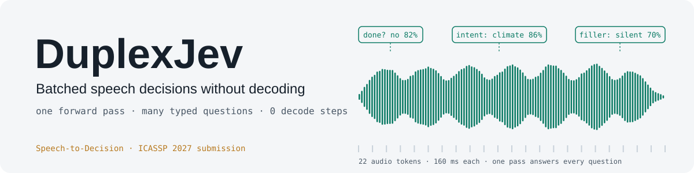
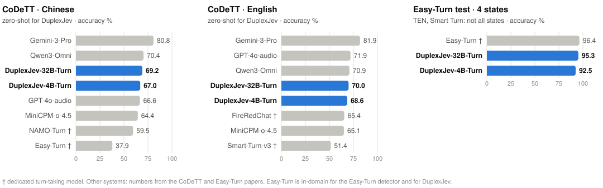

<p align="center">
  <picture>
    <source media="(prefers-color-scheme: dark)" srcset="docs/assets/banner_dark.svg">
    
  </picture>
</p>

<p align="center">
  <b>English</b> &nbsp;|&nbsp; <a href="README_CN.md">中文</a>
</p>

<p align="center">
  🎧 <a href="https://api.adventists.cn/duplexjev/">Try it online</a> &nbsp;|&nbsp;
  🌐 <a href="https://adventists-ai.github.io/duplexjev/">Project page</a> &nbsp;|&nbsp;
  📄 <a href="https://arxiv.org/abs/2610.02638">Paper (arXiv:2610.02638)</a> &nbsp;|&nbsp;
  🤗 <a href="https://huggingface.co/adventists-ai/DuplexJev-32B-Para">DuplexJev-32B-Para</a> · <a href="https://huggingface.co/adventists-ai/DuplexJev-4B-Para">4B-Para</a> · <a href="https://huggingface.co/adventists-ai/DuplexJev-32B-Turn">32B-Turn</a> · <a href="https://huggingface.co/adventists-ai/DuplexJev-32B-Stress">32B-Stress</a> · <a href="https://huggingface.co/adventists-ai/DuplexJev-4B-Turn">4B-Turn</a> · <a href="https://huggingface.co/adventists-ai/DuplexJev-4B-Stress">4B-Stress</a> &nbsp;|&nbsp;
  📦 <a href="https://pypi.org/project/duplexjev/">PyPI</a> &nbsp;|&nbsp;
  📊 <a href="https://huggingface.co/datasets/adventists-ai/qa100">qa100</a> &nbsp;|&nbsp;
  📝 <a href="#10-citation">Citation</a>
</p>

---

### DuplexJev is a speech-to-decision model.

**Input:** an audio clip and the questions you need decided, each with its options. **Output:** for every question,
the chosen option and its probability. All questions are answered together in one forward pass, with no transcription
and no text decoding: ten decisions take **about 0.1–0.24 s**, and one H200 serves about **170 decisions per second**
while keeping every request under 0.25 s ([§5](#5-performance)).

It decides from the raw audio, so it uses both **what is said** (main language) and **what a transcript drops** — who
is speaking and how (paralinguistics):

- **Main language, close to the text LLM.** Spoken multiple-choice questions: 90 against 91 when the same LLM reads the
  oracle transcript (qa100, paper). DuplexJev-32B-Turn: qa100 96, ZJU-ML 87; VoiceBench OBQA / MMSU 85.5 / 72.1
  (95.4 / 79.3 from text).
- **Paralinguistics, strong perception.** Gender 91.5, emotion 91.1, where speech LLMs trained on transcripts sit at
  chance (~55 / ~28); speaker verification is still weak *(preview‡)*: EER about 30% on the official VoxCeleb1-H list (same gender and
  nationality), against about 2% for dedicated speaker models ([research note](research/2026-10-speaker-identity.md)).
- **Stress and pauses (new).** DuplexJev-32B-Stress finds the stressed word ("**I** didn't say…" vs "I didn't say she took the
  **money**") on unseen Mandarin and English sentences, 92 / 88, and answers "no word is stressed" on 99% of neutral speech;
  the other models are at chance ([research note](research/2026-10-stress-understanding.md)).
- **Common decision tasks, on par with or above dedicated models.** Turn state on the Easy-Turn test set 95.3 (the
  dedicated Easy-Turn detector 96.4; TEN and Smart Turn cover only some states). Turn action on CoDeTT 69.2 / 70.0
  zero-shot, above every dedicated turn model (37.9–65.4) and level with Qwen3-Omni (70.4 / 70.9).

<sub>‡ Research preview: checkpoints trained on public speaker-verification pairs, not in the released models.</sub>

<p align="center">
  <picture>
    <source media="(prefers-color-scheme: dark)" srcset="docs/assets/bench_turn_dark.svg">
    
  </picture>
</p>

**One clip, eight decisions.** 🔊 *"Wait, wait — stop. That's not the address I asked for."* — said while the assistant is talking
([listen](docs/audio/ex1.wav), synthetic clip) — one call to DuplexJev-32B-Turn, 0.2 s on one H200:

| question | answer | probability |
|---|---|---:|
| What is the user's turn state? | asking to wait | 0.92 |
| What does the user want? | navigation | 1.00 |
| Which filler fits? | “One moment —” | 0.73 |
| The assistant is speaking when this comes in. What should it do? | stop and listen | 1.00 |
| Speaker gender | male | 0.99 |
| Language | English | 1.00 |
| Emotion | angry | 1.00 |
| Can the assistant handle this by itself? | ask a follow-up question first | 0.51 |

<details>
<summary><b>What it hears beyond the words: one example per ability</b></summary>

Real outputs of DuplexJev-32B-Stress (vLLM, both option orders averaged) on short clips; the same cards, with a player, are on the
[project page](https://adventists-ai.github.io/duplexjev/#abilities). Real-speech stress and phrasing clips: MSPB (CC BY 4.0). The last three rows (Para models) give benchmark scores instead of examples.

| ability | what it decides | examples → model answer (DuplexJev-32B-Stress) |
|---|---|---|
| Turn state | Has the user finished, stopped mid-sentence, only made a backchannel, or asked the assistant to wait? Intonation and rhythm decide it, not only the words. | 🔊 [帮我导航到最近的充电站。](docs/audio/ex4.wav) → **finished** 100%<br>🔊 [Could you turn the air conditioning down a little and, um —](docs/audio/ex3.wav) → **not finished** 99%<br>🔊 [Mm-hmm, yeah.](docs/audio/ex2.wav) → **just a backchannel** 100%<br>🔊 [等一下，我想想……](docs/audio/ex5.wav) → **asking to wait** 100% |
| Barge-in while speaking | While the assistant is talking, tell a real interruption from a backchannel: stop and listen, or keep talking. | 🔊 [Wait, wait — stop. That's not the address I asked for.](docs/audio/ex1.wav) → **stop and listen** 100%<br>🔊 [Mm-hmm, yeah.](docs/audio/ex2.wav) → **keep talking** 100% |
| Voices not meant for the assistant | People chatting nearby, a TV, or noise should neither trigger a reply nor stop the assistant. | 🔊 [哎你晚上吃什么？要不我们去吃火锅吧。——行啊，那我先订个位子。](docs/audio/ab_b1.wav) → **stay silent and keep waiting (not addressed to the assistant)** 100% |
| Emotion | Neutral, happy, angry or sad, heard in the voice rather than read from the words. | 🔊 [Wait, wait — stop. That's not the address I asked for.](docs/audio/ex1.wav) → **angry** 100%<br>🔊 [太好了，谢谢你！](docs/audio/ex6.wav) → **happy** 93%<br>🔊 [帮我导航到最近的充电站。](docs/audio/ex4.wav) → **neutral** 100% |
| Speaker gender | Perceived gender of the voice, a cue a transcript does not carry. | 🔊 [帮我导航到最近的充电站。](docs/audio/ex4.wav) → **male** 100%<br>🔊 [太好了，谢谢你！](docs/audio/ex6.wav) → **female** 100% |
| Stress (word focus) 🆕 | Same words, different stressed word, different meaning. The model tells which word carries the stress, and also when no word is stressed. | 🔊 [**张昊**昨晚做烤肉。](docs/audio/ab_m1.wav) → **张昊 (Zhang Hao)** 100%<br>🔊 [张昊**昨晚**做烤肉。](docs/audio/ab_m2.wav) → **昨晚 (last night)** 100%<br>🔊 [张昊昨晚**做烤肉**。](docs/audio/ab_m3.wav) → **做烤肉 (made barbecue)** 97%<br>🔊 [我明天去北京开会。](docs/audio/ab_n0.wav) → **no word is particularly emphasized** 96% |
| Pauses and phrasing 🆕 | Where the speaker pauses can change the structure of a sentence: one item or two, who did what to whom. | 🔊 [我买了巧克力雪糕｜和果汁。](docs/audio/ab_q1.wav) → **two (chocolate ice cream, juice)** 96%<br>🔊 [我买了巧克力｜雪糕｜和果汁。](docs/audio/ab_q2.wav) → **three (chocolate, ice cream, juice)** 98% |
| Non-verbal sounds 🆕 (Para) | Laughter, breathing, coughs, sighs, sniffing, throat clearing, sneezes, crying, with a "none" option. | Unseen real speech (NonverbalTTS test), AUC laughter / breathing / cough / sigh: 32B-Para 0.85 / 0.73 / 0.70 / 0.74, 4B-Para 0.80 / 0.76 / 0.75 / 0.81 (before: 0.40–0.73; an AudioSet AST tagger: 0.71–0.85). |
| Speaking style 🆕 (Para) | Whispering, shouting, very fast or slow, unusually high or low pitch, or a normal voice. | 7-way on held-out EARS speakers: 69% (32B-Para) / 67% (4B-Para), from 45–55%. |
| Who is speaking 🆕 (Para) | Same speaker or not, given a voice sample. A coarse, human-like sense of "same voice", far behind dedicated speaker models; not for identifying people. | Same-gender AISHELL-1 pairs: EER 18% (32B-Para) / 9% (4B-Para); official VoxCeleb1-H list: 40% / 37% (dedicated x-vector model: ~2–4%). |

</details>

<details>
<summary><b>Full comparison on common decision tasks</b></summary>

| task | benchmark | DuplexJev | dedicated and other models |
|---|---|---:|---|
| turn state: finished / unfinished / backchannel / wait | Easy-Turn test (800) | **95.3** | Easy-Turn detector 96.4 · TEN Turn Detection and Smart Turn v2 cover only 3 / 2 of the 4 states |
| what to do, system state given | CoDeTT zh / en (18 k, zero-shot) | **69.2 / 70.0** | Easy-Turn 37.9 (zh) · Smart-Turn-v3 51.4 (en) · NAMO-Turn 59.5 (zh) · FireRedChat 65.4 (en) · GPT-4o-audio 66.6 / 71.9 · Qwen3-Omni 70.4 / 70.9 · Gemini-3-Pro 80.8 / 81.9 |
| gender | 800 real utterances (AISHELL-1, LibriSpeech) | **91.5** | speech LLMs trained on transcripts: ~55 (chance) |
| emotion (4-way) | 800 utterances (ESD, CREMA-D) | **91.1** | speech LLMs trained on transcripts: ~28 (chance) |
| same speaker? | official VoxCeleb1-H list: different speakers share gender and nationality (2,000 trials) | **EER 36.9%** (4B-Para) / 40.3% (32B-Para); research checkpoints‡ 29.6% / 31.2% | gender alone: chance (50); dedicated speaker models (ECAPA-TDNN): EER ≈ 2% |
| laughter / breathing / cough / sigh | NonverbalTTS test (real speech, unseen), AUC | **0.85 / 0.73 / 0.70 / 0.74** (32B-Para) | AudioSet AST tagger 0.71 / 0.75 / 0.85 / 0.76 |
| spoken knowledge QA | VoiceBench OBQA / MMSU | **85.5 / 72.1** | same LLM reading the transcript: 95.4 / 79.3 |

Other systems' numbers are from their papers (Easy-Turn Table 2, CoDeTT, Dynamic-SUPERB Phase-2). Easy-Turn is in-domain
for both the Easy-Turn detector and our model. ‡ Research checkpoints trained only for speaker verification
(no VoxCeleb1 speakers), not released; the Para models trade some of that for keeping every other ability; see the [research note](research/2026-10-speaker-identity.md). On random pairs about half of the different-speaker pairs also differ in
gender, so a gender-only guess already reaches 74%; we therefore report hard pairs only. Details: [§5](#5-performance).

</details>

**Models:** 🤗 [**DuplexJev-32B-Para**](https://huggingface.co/adventists-ai/DuplexJev-32B-Para) (one 80 GB GPU) ·
🤗 [**DuplexJev-4B-Para**](https://huggingface.co/adventists-ai/DuplexJev-4B-Para) (~10 GB), served with vLLM ([§4](#4-quick-start)).
New: they also hear **laughter, breathing, coughs and sighs**, **how** someone is talking (whispering, shouting) and
whether two clips are **the same speaker** — [try it](#try-the-new-abilities).

## 1. Introduction

**DuplexJev** turns a frozen speech LLM into a *typed decision engine* for full-duplex spoken agents
(product name: **Speech-to-Decision**). Hidden states of an off-the-shelf ASR encoder are projected into a frozen
LLM, and every runtime-declared question — *is the turn complete? which filler to play? who is speaking?* — is read
as a **single-token, closed-set distribution**: no ASR decoding, no text decoding. Many questions, about one call or
across many calls, share one forward pass. All released models are ready to serve with vLLM ([§3](#3-models)); we
recommend **[DuplexJev-32B-Para](https://huggingface.co/adventists-ai/DuplexJev-32B-Para)**, or
**[DuplexJev-4B-Para](https://huggingface.co/adventists-ai/DuplexJev-4B-Para)** on smaller GPUs.

```
audio ──► Qwen3-ASR-0.6B encoder (frozen)
                 ▼  last layer
          connector: stack 2 frames → 6.25 tokens/s, MLP → d_LLM        ← trained (Turn models: + rank-16 LoRA on the LLM)
                 ▼
state + N typed questions ──► frozen LLM, ONE forward pass
                              (DuplexJev-32B: language model of Qwen3-VL-32B · DuplexJev-4B: Qwen3-4B)
                 ▼
          p(A|q1) … p(D|q1),  …,  p(A|qN) … p(D|qN)      — 0 decode steps
```

- **Typed single-token readout.** Each question lists its options under permuted letters; the answer is the next-token
  softmax restricted to those letters. The output is always valid, and `max p` is a confidence score.
- **Hears the speaker, not only the words.** Transcript distillation leaves speech LLMs deaf to gender and emotion;
  supervising the single answer token lifts both to about 90% while content understanding moves by about 1 point.
- **Prefix sharing.** Context and audio are encoded once and all question suffixes are packed into one row under a
  block-diagonal mask; answers match one-by-one runs up to bf16 noise.

## 2. News

- **2026-10-10** — 🔬 Research preview: **image + voice together.** DuplexJev-32B-Para's language model is Qwen3-VL's, so the vision encoder plugs back in; with one more LoRA it checks what it hears against what it sees (stressed word vs. the red word 94.1, voice vs. face 93.5, sound vs. caption 97.5 on held-out synthetic sets; image alone = 50). Not in a released checkpoint yet. Real examples, including the misses, on the [project page](https://adventists-ai.github.io/duplexjev/#abilities).
- **2026-10-10** — 🤗 [**DuplexJev-4B-Para v1.1**](https://huggingface.co/adventists-ai/DuplexJev-4B-Para): the same small model now also **holds a normal conversation**, multi-turn included, while keeping the decision scores of v1.0 (conversation replay in the LoRA stage, per-row loss). v1.0 stays available as revision `v1.0`. [Research note](research/2026-10-chat-replay.md).
- **2026-10-09** — 🤗 [**DuplexJev-32B-Para**](https://huggingface.co/adventists-ai/DuplexJev-32B-Para) and
  [**DuplexJev-4B-Para**](https://huggingface.co/adventists-ai/DuplexJev-4B-Para): the widest set of paralinguistic
  abilities in one model. On top of turn-taking, gender, emotion, stress and pauses they hear **laughter, breathing,
  coughs and sighs** (AUC 0.70–0.85 on unseen real speech, from 0.40–0.73), recognise **speaking style** (whisper,
  shouting, fast, slow …) and judge **same speaker or not** roughly as a person would. 4B-Para is also the strongest
  4B on spoken QA (qa100 79, VoiceBench 57.8 / 41.8) and is now the default model of the `duplexjev` package (0.4).
- **2026-10-08** — 🤗 [**DuplexJev-32B-Stress**](https://huggingface.co/adventists-ai/DuplexJev-32B-Stress): DuplexJev-32B-Turn
  that also hears **stress and pauses**. Which word is stressed: 92 (Mandarin, held-out sentences) / 88 (English); neutral speech
  answered "no word is stressed" 99%; spoken QA, gender, emotion and turn-taking unchanged within noise. Trained with balanced
  negatives in every speech source; meaning-choice items were left out because they cost VoiceBench points. Also
  🤗 [**DuplexJev-4B-Stress**](https://huggingface.co/adventists-ai/DuplexJev-4B-Stress) (which word is stressed 95 / 95; about 4 points below 4B-Turn on VoiceBench).
  [Research note](research/2026-10-stress-understanding.md).
- **2026-10-05** — 📄 Paper on arXiv: [arXiv:2610.02638](https://arxiv.org/abs/2610.02638). 🤗 [**DuplexJev-32B-Turn**](https://huggingface.co/adventists-ai/DuplexJev-32B-Turn)
  and [**DuplexJev-4B-Turn**](https://huggingface.co/adventists-ai/DuplexJev-4B-Turn): a turn-taking upgrade (connector + rank-16
  LoRA on public turn-taking data). 32B-Turn: Easy-Turn 95.3, CoDeTT 69.2 / 70.0 zero-shot, with qa100, gender and emotion
  all slightly up. [Research note](research/2026-10-turn-taking-lora.md).
- **2026-10-03** — 🤗 [**DuplexJev-Gemma-31B**](https://huggingface.co/adventists-ai/DuplexJev-Gemma-31B), the first
  non-Qwen model: Qwen3-ASR-0.6B encoder + connector + Gemma-4-31B-it with a merged LoRA. In vLLM: qa100 97, gender
  94.4, emotion 90.6 (no turn-taking training yet). Needs [`duplexjev-vllm`](https://pypi.org/project/duplexjev-vllm/) ≥ 0.2.0.
- **2026-10-01** — 🎧 [**Online demo and trial API**](https://api.adventists.cn/duplexjev/) (DuplexJev-4B) and
  [`duplexjev` 0.3](https://pypi.org/project/duplexjev/): `duplexjev quick call.wav` prints a table of eight default
  decisions (turn state, what to do, barge-in, intent, emotion, gender, language, wants a human) for any clip.
- **2026-09-30** — 🤗 [**DuplexJev-32B**](https://huggingface.co/adventists-ai/DuplexJev-32B), our new recommended model:
  Qwen3-ASR-0.6B encoder + connector + the language model of Qwen3-VL-32B, one repository, served with vLLM.
  Best total score so far (87.7): qa100 90, Easy-Turn 79.1, gender 89.4, emotion 90.6; spoken VoiceBench MMSU 70.8
  (earlier 32B connectors: 56–60). DuplexJev-4B updated with the same recipe (total 75.9 → 78.6). Connector checkpoints moved to [their own page](docs/connectors.md).
- **2026-09-28** — New [research notes](research) section. First note: [does cross-layer fusion help a speech connector?](research/2026-09-connector-a-vs-b.md)
- **2026-09-28** — First complete model, 🤗 [DuplexJev-4B](https://huggingface.co/adventists-ai/DuplexJev-4B), and the
  vLLM plugin [`duplexjev-vllm`](https://pypi.org/project/duplexjev-vllm/).

Coming next: Speech-to-Decision commercial API (2026-10-10), open-source full-duplex Jev dialogue pipeline (2026-10-15).

## 3. Models

Each model is **one repository with everything needed** (audio encoder + trained connector + LLM) and runs on
[vLLM](https://github.com/vllm-project/vllm) with a small plugin ([§4](#4-quick-start)).

| model | for | built on | params | GPU memory | qa100 | ZJU-ML | Easy-Turn | gender | emotion | total | licence |
|---|---|---|---:|---:|---:|---:|---:|---:|---:|---:|---|
| ⭐ 🤗 [**DuplexJev-32B-Para**](https://huggingface.co/adventists-ai/DuplexJev-32B-Para) 🆕 | server, widest set of abilities | as 32B-Turn (+ a second rank-16 LoRA) | 33.0 B | one 80 GB GPU | 95 | 87 | 94.0\* | **92.1** | 89.5 | 91.4 | CC BY-NC 4.0 |
| ⭐ 🤗 [**DuplexJev-4B-Para**](https://huggingface.co/adventists-ai/DuplexJev-4B-Para) 🆕 | small GPU, widest set of abilities, **and normal conversation** (v1.1); `duplexjev` default | as 4B-Turn (+ a second rank-16 LoRA) | 4.2 B | ~10 GB | 77 | **58** | 91.0\* | 89.2 | 90.0 | **82.5** | CC BY-NC 4.0 |
| 🤗 [**DuplexJev-32B-Turn**](https://huggingface.co/adventists-ai/DuplexJev-32B-Turn) | server, best quality | Qwen3-VL-32B (language model, + rank-16 LoRA) + Qwen3-ASR-0.6B encoder | 33.0 B | one 80 GB GPU | **96** | 87 | **95.3**\* | **91.5** | **91.1** | **92.2** | CC BY-NC 4.0 |
| 🤗 [DuplexJev-32B-Stress](https://huggingface.co/adventists-ai/DuplexJev-32B-Stress) 🆕 | server, + stress and pauses | as 32B-Turn (+ a second rank-16 LoRA) | 33.0 B | one 80 GB GPU | **96** | 87 | 94.4\* | **92.1** | **91.4** | — | CC BY-NC 4.0 |
| 🤗 [DuplexJev-4B-Turn](https://huggingface.co/adventists-ai/DuplexJev-4B-Turn) | small GPU, edge | Qwen3-4B (+ rank-16 LoRA) + Qwen3-ASR-0.6B encoder | 4.2 B | ~10 GB | 74 | 52 | 92.5\* | 89.4 | 92.0 | 80.0 | CC BY-NC 4.0 |
| 🤗 [DuplexJev-4B-Stress](https://huggingface.co/adventists-ai/DuplexJev-4B-Stress) 🆕 | small GPU, + stress and pauses | as 4B-Turn (+ a second rank-16 LoRA) | 4.2 B | ~10 GB | 73 | 51 | 91.8\* | 89.1 | 91.4 | — | CC BY-NC 4.0 |

**What the Para models add** (AUC, 0.5 = chance; unseen real speech from the NonverbalTTS test set and a third-party
sample of natural Mandarin conversation; speaker EER on same-gender AISHELL-1 pairs):

| | laughter | breathing | cough | sigh | laughter / breathing in conversation | speaking style (7 classes) | same speaker? EER |
|---|---:|---:|---:|---:|---:|---:|---:|
| 32B-Stress | 0.73 | 0.56 | 0.40 | 0.70 | 0.61 / 0.44 | 45% | — |
| **32B-Para** | **0.85** | **0.73** | **0.70** | **0.74** | **0.80 / 0.78** | **69%** | 18% |
| **4B-Para** v1.1 | 0.81 | 0.77 | 0.77 | 0.71 | 0.85 / 0.74 | 67% | ≈ v1.0 (9%)¹ |
| 4B-Para v1.0 | 0.80 | 0.76 | 0.75 | 0.81 | 0.84 / 0.84 | 67% | 9% |

¹ v1.1 was not re-run on the AISHELL-1 pairs; on VoxCeleb1 hard pairs its EER is 42.0% vs 41.8% for v1.0.

The costs are small and listed on the model cards (32B-Para: emotion −1.6 and Easy-Turn −1.2 vs 32B-Turn;
4B-Para: ZJU-ML −2, Easy-Turn −1 vs 4B-Turn). Speaker judgments are coarse, human-like, and must not be used to
identify people.

**DuplexJev-4B-Para v1.1 (2026-10-10)** is trained with conversation replay, so the same weights also hold a normal conversation. Decision scores are within 0.5–2.6 points of v1.0 (still available as revision `v1.0`); see the [research note](research/2026-10-chat-replay.md). The 32B version is training.

The Stress models add stress and pause understanding (which word is stressed: 92 / 95 on held-out Mandarin sentences for 32B / 4B; see the [research note](research/2026-10-stress-understanding.md)). 32B-Stress matches 32B-Turn on every other benchmark within noise. **4B-Stress trades about 4 points of VoiceBench** (42.0 / 38.2 vs 46.4 / 41.7) for it, so 4B-Turn stays the default small model.


Earlier versions without the turn-taking upgrade, [DuplexJev-32B](https://huggingface.co/adventists-ai/DuplexJev-32B) (total 87.7)
and [DuplexJev-4B](https://huggingface.co/adventists-ai/DuplexJev-4B) (78.6), stay online but are superseded: the Turn models
are equal or better on every benchmark we run.

% under the paper protocol (single-token readout); total = mean of main language (qa100, ZJU-ML, Easy-Turn) and
paralinguistics (gender, emotion), see [Benchmarks](#6-benchmarks). \* Both models were trained with the Easy-Turn
training split (disjoint from the test set), so their Easy-Turn scores are in-domain. Both answer ten questions about one clip in about
0.1–0.25 s on one GPU.

**Also available: 🤗 [DuplexJev-Gemma-31B](https://huggingface.co/adventists-ai/DuplexJev-Gemma-31B)** (Gemma-4-31B-it +
Qwen3-ASR-0.6B encoder, ~58 GB, one 80 GB GPU, CC BY-NC 4.0). No turn-taking training yet; like the Turn models, its LLM carries a merged LoRA. Served by vLLM in the prompt wording of [§4](#4-quick-start): qa100 97, ZJU-ML 87, gender 94.4, emotion
90.6; Easy-Turn 68.0 zero-shot (no turn-taking training). It is sensitive to question wording (paper-protocol wording:
gender 78.5, emotion 60.9), so it is not in the table above; details on its model card.

**Which one to use.** The **Para** models if you want everything the voice carries (non-verbal sounds, speaking style,
speaker, stress, emotion, gender, turn-taking) in one model — `DuplexJev-32B-Para` on an 80 GB GPU, `DuplexJev-4B-Para`
on smaller GPUs. `DuplexJev-32B-Turn` / `4B-Turn` if the last point of emotion and turn-taking matters most;
`DuplexJev-32B-Stress` / `4B-Stress` if stress and pauses are the main thing. The Turn
models are drop-in replacements (same prompts, same plugin) and equal or better on every benchmark we run (within noise). The 32B models
use only the language model of Qwen3-VL-32B: their inputs are audio and text for now (image input is planned).

> **Research checkpoints.** Behind these models are several dozen connector checkpoints for other encoders (MOSS, Whisper,
> SenseVoice), LLMs (Qwen3 0.6B–32B, Falcon-H1, SmolLM3) and both connector types, used with the `duplexjev` PyTorch
> package. Leaderboard, details and package usage: **[docs/connectors.md](docs/connectors.md)**.

## 4. Quick start

**Without a GPU** — ask our trial API (rate-limited, audio is not stored):

```bash
pip install duplexjev
duplexjev quick call.wav --api https://api.adventists.cn/duplexjev            # English speech
duplexjev quick call_zh.wav --api https://api.adventists.cn/duplexjev --lang zh
```

```
decision       answer                             confidence
------------------------------------------------------------
turn state     finished, the assistant can reply  0.74
what to do     reply now                          0.50
...
8 decisions in 80 ms
```

Your own questions: `--questions table.json` (a list of `{"id", "text", "options"}`), or in Python
`quick("call.wav", questions=[Question("product", "Which product is the user asking about?", ["phone", "laptop", "other"])])`.
The same page with a recorder is at [api.adventists.cn/duplexjev](https://api.adventists.cn/duplexjev/).

**On your own GPU** with vLLM:

```bash
pip install "vllm[audio]>=0.29" duplexjev-vllm
vllm serve adventists-ai/DuplexJev-4B-Para --max-model-len 4096   # or adventists-ai/DuplexJev-32B-Para
duplexjev quick call.wav --vllm http://localhost:8000/v1           # the default table against your server
duplexjev gateway --vllm http://localhost:8000/v1 --port 8020      # this web demo + HTTP API in front of it
```

Or ask your own questions from Python (one request per question, `max_tokens=1`, OpenAI-compatible API):

```python
from vllm_client import DuplexJevClient      # examples/vllm_client.py: openai + standard library only

dj = DuplexJevClient("http://localhost:8000/v1")
dj.decide(open("call_017.wav", "rb").read(), {
    "turn":    ("Has the user finished speaking?", ["finished", "not finished"]),
    "gender":  ("What is the perceived gender of the speaker?", ["female", "male"]),
    "emotion": ("What is the speaker's emotional state?", ["neutral", "happy", "angry", "sad"]),
})
# {'turn': {'answer': 'finished', 'confidence': 0.88, 'probs': {...}}, 'gender': {...}, 'emotion': {...}}

# Chinese speech: ask in Chinese
dj.decide(open("call_018.wav", "rb").read(), {"gender": ("说话人的性别是？", ["男性", "女性"])}, lang="zh")
```

The questions about one clip are sent concurrently and share the audio prefix in vLLM's prefix cache. Ask in the
language of the clip. The prompt format and the plugin are described on the
[model card](https://huggingface.co/adventists-ai/DuplexJev-32B) and in [`vllm_plugin/`](vllm_plugin).
To use a connector checkpoint with the PyTorch package instead, see [docs/connectors.md](docs/connectors.md#pytorch-package).

### Try the new abilities

With a Para model (`vllm serve adventists-ai/DuplexJev-4B-Para`, or locally with `pip install "duplexjev[speech]"`), the
default table of `duplexjev quick` has two more rows, *non-verbal sound* and *speaking style*. Or ask directly
(these are the wordings the models were trained on; always keep a "none" option):

```python
dj.decide(clip, {
    "laugh":  ("Is there laughter in this audio?", ["Yes", "No"]),
    "sound":  ("Besides speech, which sound can be heard in this audio?", ["laughter", "breathing", "coughing", "a sigh", "None of these"]),
    "style":  ("How is the speaker talking?", ["whispering", "speaking very loudly / shouting", "a normal speaking voice"]),
    "stress": ("Does the speaker stress one of these words, or none of them?", ["I", "say", "money", "None of these words is emphasized"]),
})
dj.decide(clip_zh, {"sound": ("除了说话，这段音频里还有哪种声音？", ["笑声", "呼吸声", "咳嗽", "叹气", "都没有"])}, lang="zh")
```

Same speaker or not: put a voice sample and the new clip in one file with about 0.8 s of silence between them and ask
`"Before the silence is a voice sample of someone; after it is another clip. Are they the same speaker?"` with options
`["different speakers", "same speaker"]` (Chinese: `"静音前是某人的一段声音样本，静音后是另一段语音。两段是同一个人吗？"`, `["是不同的人", "是同一个人"]`).
Ready-made scripts: [`examples/para_abilities.py`](examples/para_abilities.py).

## 5. Performance

### Turn-taking vs. dedicated detectors

DuplexJev-32B-Turn decides turn-taking as well as dedicated detectors do, and in the same forward pass it also answers
every other question you declare (intent, emotion, gender, barge-in, …). It does not decode any tokens, so ten
decisions about one clip cost about as much as one.

| model | Easy-Turn test (complete / incomplete / backchannel / wait) | Easy-Turn overall | CoDeTT zh / en | other decisions in the same call | latency |
|---|---|---:|---:|---|---|
| Smart Turn v2 (95 MB) | 78.7 / 62.0 / – / – | – | – / 51.4 (v3) | no | 27 ms |
| TEN Turn Detection (7 B) | 86.7 / 89.3 / – / 91.0 | – | – | no | 204 ms |
| Easy-Turn (0.85 B) | 96.3 / 97.7 / 91.0 / 98.0 | 96.4 | 37.9 / – | no | 263 ms |
| NAMO-Turn · FireRedChat | – | – | 59.5 / – · – / 65.4 | no | – |
| GPT-4o-audio · Qwen3-Omni | – | – | 66.6 / 71.9 · 70.4 / 70.9 | yes, by generating text | seconds |
| **DuplexJev-32B-Turn** (ours) | **98.7** / 94.3 / 88.0 / 95.0 | **95.3** | **69.2 / 70.0** | **yes, any number, one pass** | **~0.24 s for 10 decisions** (one H200) |
| DuplexJev-4B-Turn (ours) | 92.3 / 93.0 / 90.0 / 94.0 | 92.5 | 67.0 / 68.6 | yes | ~0.08 s for 8 decisions (one H100) |

- **Easy-Turn**: accuracy (%) on the 800-item test set. Easy-Turn itself and our Turn models were both trained on its
  training split. Other rows are from the Easy-Turn paper (Table 2, their hardware); their latency is per single decision.
- **CoDeTT** ([arXiv:2603.25434](https://arxiv.org/abs/2603.25434)): 18 k items, system state given, mean of four
  action accuracies. Zero-shot for us: no CoDeTT data in training. Other rows are from the CoDeTT paper. Our protocol gives
  the current utterance as audio without history; the official one also plays earlier user turns.
- On our TurnBench-dev clip protocol (not the official leaderboard), the Turn models reach 88.7 (32B) and 87.3 (4B),
  against 60.7 and 49.4 before the upgrade.
- **Nothing else got worse.** For 32B: qa100 90 → 96, gender 89.4 → 91.5, emotion 90.6 → 91.1, VoiceBench MMSU
  70.8 → 72.1. How it was done (public data only, a rank-16 LoRA, one recipe for 4B and 32B):
  [research note](research/2026-10-turn-taking-lora.md).

### Speed and spoken knowledge

| | DuplexJev-32B(-Turn) | DuplexJev-4B(-Turn) |
|---|---|---|
| one decision event (ten questions about one clip, sent as ten concurrent requests to the vLLM OpenAI server) | median **240 ms** on one H200 | about **80 ms** for the eight default questions on one H100 (our trial API) |
| GPU memory | one 80 GB GPU | ~10 GB |
| spoken knowledge, VoiceBench OBQA / MMSU (speech in) | **83.7 / 70.8** | 47.3 / 41.3 |

For reference, the same LLM answering from text reaches 95.4 / 79.3 (Qwen3-VL-32B). Against the usual cascade
(transcribe, then let the LLM generate JSON), the single-token readout answers ten decisions in 92 ms instead of
1,567 ms + 411 ms ASR (paper measurement: Qwen3-32B on one H200, vLLM, all ten questions in one packed request). Full tables:
[docs/paper_results.md](docs/paper_results.md).

## 6. Benchmarks

| benchmark | task | size | link |
|---|---|---:|---|
| qa100 | spoken multiple-choice, synthetic speech (zh + en) | 100 | 🤗 [adventists-ai/qa100](https://huggingface.co/datasets/adventists-ai/qa100) |
| ZJU-ML | main-language part of the ZJU audio benchmark v2.0.0: spoken questions, half real speech | 100 | [GitHub](https://github.com/Vsky-morigen/audio-gender-benchmark) |
| Easy-Turn | four-way turn state (complete / incomplete / backchannel / wait); the complete models are trained on its training split | 800 | Easy-Turn test set ([arXiv:2509.23938](https://arxiv.org/abs/2509.23938)) |
| gender | speaker gender, real speech (AISHELL-1, Common Voice, LibriSpeech), zh + en | 800 | [`evaluation/`](evaluation) |
| emotion | neutral / happy / angry / sad, acted speech (ESD, CREMA-D), zh + en | 800 | [`evaluation/`](evaluation) |

**Main language** = mean of qa100, ZJU-ML and Easy-Turn; **paralinguistics** = mean of gender and emotion;
**total** = mean of the two. Chance: 25% on the four-way tasks, 50% on gender. The [connector leaderboard](docs/connectors.md#leaderboard) is generated by
[`evaluation/build_leaderboard.py`](evaluation/build_leaderboard.py) from the result files next to it.

## 7. Training

Frozen encoder and frozen LLM; only the connector is trained, with a patched
[Ultravox](https://github.com/fixie-ai/ultravox). Both complete models follow the same three stages:

1. **Content, R1 and R2.** Transcript distillation on the Ultravox v0.6 mixture (WenetSpeech, GigaSpeech, Common Voice,
   CoVoST 2, People's Speech, LibriSpeech, MLS, MUSAN), split into 100 disjoint packs; R1 and R2 use one pack each.
2. **Decisions.** Cross-entropy on the single option letter at the readout position: turn state (Easy-Turn training
   split), gender (AISHELL-1, LibriSpeech) and emotion (ESD, CREMA-D).
3. **Mixed run.** One run from R2 over content and decision samples (distillation for content, answer-token
   cross-entropy for decisions); 4,000 steps, learning rate 1e-4, with content weighted up (×10) and gender and emotion
   weighted down (×0.5) so that content understanding is kept while turn state, gender and emotion are learned.

Recipe, data links and scripts: [`training/`](training). The emotion corpora are not redistributed. The research
checkpoints in [docs/connectors.md](docs/connectors.md) use earlier versions of this recipe.

## 8. Repository layout

| path | contents |
|---|---|
| [`vllm_plugin/`](vllm_plugin) | `duplexjev-vllm`: the vLLM plugin that serves DuplexJev-32B, DuplexJev-4B and DuplexJev-Gemma-31B |
| [`duplexjev/`](duplexjev) | the `duplexjev` package: `quick()` and the default decision table, vLLM and API clients, the web demo gateway; the PyTorch `Decider` for connector checkpoints |
| [`examples/`](examples) | [vLLM client](examples/vllm_client.py), quick starts, server client |
| [`evaluation/`](evaluation) | benchmark runners and results |
| [`training/`](training) | Ultravox configs and patches, data recipe, 100-pack split, encoder ports |
| [`research/`](research) | research notes: experiments and design decisions, with numbers and noise levels |
| [`docs/`](docs) | project page, [connector checkpoints](docs/connectors.md), [paper results](docs/paper_results.md), [package details](docs/package.md) |
| [`duplexjev/research/`](duplexjev/research), [`tests/`](tests), [`benchmarks/`](benchmarks) | paper code (readout, question contract, fused encoder), equivalence tests, latency and capacity experiments |

The paper code still contains paths from our cluster; see [docs/PATHS.md](docs/PATHS.md).

## 9. License

Code: Apache-2.0 ([LICENSE](LICENSE)). Complete models (DuplexJev-32B, DuplexJev-4B, DuplexJev-Gemma-31B): CC BY-NC 4.0, because their
connectors were trained on emotion data. Connector weights: Apache-2.0, except those trained on emotion data
(`-Emotion-` and `-Para-`), which are CC BY-NC 4.0 because ESD is licensed for research only. qa100: CC-BY-4.0.
The frozen encoders and LLMs keep their own licences (Falcon-H1: TII Falcon License; SenseVoice: FunASR Model License).
Some training corpora (e.g. WenetSpeech, CoVoST 2) have non-commercial terms. See [NOTICE](NOTICE).

## 10. Citation

```bibtex
@misc{jin2026duplexjev,
  title         = {Batched Speech Decisions Without Decoding: Single-Token Supervision Lets a Frozen {LLM} Hear Beyond the Transcript},
  author        = {Jin, Jie and Ma, Ziyin and Yin, Min and Chen, Jinyu and Song, Haigang and Pang, Zhikun and Zhang, Xiaowen},
  year          = {2026},
  eprint        = {2610.02638},
  archivePrefix = {arXiv},
  note          = {Submitted to IEEE ICASSP 2027}
}
```

## 11. Acknowledgements

DuplexJev-32B and DuplexJev-4B are built on [Qwen3-VL](https://github.com/QwenLM/Qwen3-VL),
[Qwen3](https://github.com/QwenLM/Qwen3) and Qwen3-ASR (DuplexJev-Gemma-31B on [Gemma 4](https://huggingface.co/google/gemma-4-31B-it)), trained with [Ultravox](https://github.com/fixie-ai/ultravox)
and served with [vLLM](https://github.com/vllm-project/vllm). The research checkpoints also use
[MOSS-Transcribe-Diarize](https://huggingface.co/OpenMOSS-Team/MOSS-Transcribe-Diarize), Whisper, SenseVoice, SmolLM3
and Falcon-H1. We thank the ZJU team for the [audio benchmark](https://github.com/Vsky-morigen/audio-gender-benchmark).
Claude (Anthropic) assisted with code.
Questions and issues: [GitHub Issues](https://github.com/adventists-ai/duplexjev/issues).
