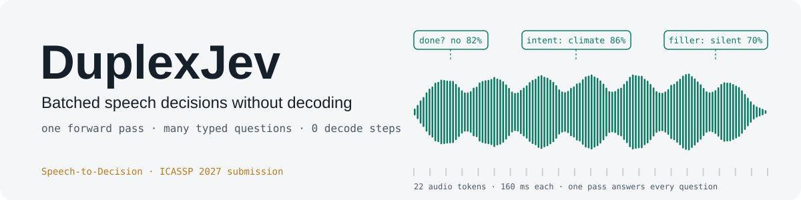

<p align="center">
  <picture>
    <source media="(prefers-color-scheme: dark)" srcset="docs/assets/banner_dark.svg">
    
  </picture>
</p>

<p align="center">
  <a href="README.md">English</a> &nbsp;|&nbsp; <b>中文</b>
</p>

<p align="center">
  🌐 <a href="https://adventists-ai.github.io/duplexjev/#zh">项目主页</a> &nbsp;|&nbsp;
  📄 论文（arXiv，即将发布） &nbsp;|&nbsp;
  🤗 模型权重（即将发布） &nbsp;|&nbsp;
  📊 <a href="https://huggingface.co/datasets/adventists-ai/qa100">qa100</a> &nbsp;|&nbsp;
  📝 <a href="#9-引用">引用</a>
</p>

---

## 1. 简介

**DuplexJev** 把一个冻结的语音大模型变成面向全双工语音智能体的**类型化判断引擎**（产品名 **Speech-to-Decision**）。
现成 ASR 编码器的隐状态经投影送入冻结的大模型；运行时声明的每个问题——*用户说完了吗？先说哪句垫话？流程走到哪一步？*——
都读成**单个 token 上的闭集概率分布**：不做 ASR 解码，也不做文本解码。同一通电话的多个问题、乃至多通电话的问题，
可以在同一次前向计算里一起完成。

论文：*Batched Speech Decisions Without Decoding: A Modular Decision Sidecar for Full-Duplex Spoken Agents*（已投 ICASSP 2027）。

```
音频 ──► 冻结的 ASR 编码器（Qwen3-ASR-0.6B，12.5 Hz）
            ├─ B：最后一层 h18 ───────────────────────────────┐
            └─ A：交叉注意力融合  Q=h18, K=h14, V=h9 ─────────┤ （零初始化，残差）
                                                              ▼
                            投影器（每 2 帧拼接 → 6.25 token/秒，MLP → d_LLM）
                                                              ▼
状态 + N 个类型化问题 ──► 冻结的大模型（Qwen3-32B），一次前向
                                                              ▼
            p(A|q1) … p(D|q1),  …,  p(A|qN) … p(D|qN)      —— 0 步解码
```

- **类型化单 token 读出。** 每个问题的选项用打乱的字母标注，答案取下一个 token 在这些字母上的 softmax。输出一定合法，`max p` 可作置信度。
- **前缀共享。** 模板、对话上下文和音频只编码一次；所有问题后缀打包进同一行，用块对角 4-D 掩码隔开，位置编号从前缀长度重新开始。
  KV 缓存只占 `P + ΣL_i` 个位置，而不是 `N(P + L)`；答案与逐个运行一致（仅 bf16 数值误差）。
- **模块化。** 任意 ASR 编码器 + 小型可训练投影器（3990 万参数；A 版融合模块另加 320 万）+ 任意接受嵌入输入的冻结大模型。

## 2. 最新动态

- **2026-09** —— 论文投稿 ICASSP 2027；发布研究代码、延迟基准和项目主页。
- **2026-10-10（计划）** —— Speech-to-Decision 商用 API 上线。
- **2026-10-15（计划）** —— 开源推理管线与模型权重。

## 3. 模型下载

每个权重都是**专门连接一对模型的适配器**：只包含训练好的投影器（A 版另含融合模块），用来把下表中冻结的 ASR 编码器
接到冻结的大模型上。换成别的编码器或大模型（包括同系列的其他尺寸）都不能用，需要重新训练适配器。

| 模型 | ASR 编码器（冻结） | 大模型（冻结） | 编码器读出 | 可训练参数 | 下载 |
|---|---|---|---|---:|---|
| DuplexJev-A | [Qwen3-ASR-0.6B](https://huggingface.co/Qwen/Qwen3-ASR-0.6B) | [Qwen3-32B](https://huggingface.co/Qwen/Qwen3-32B) | 交叉注意力融合（h18 / h14 / h9） | 43.1 M | 🤗 即将发布 |
| DuplexJev-B | [Qwen3-ASR-0.6B](https://huggingface.co/Qwen/Qwen3-ASR-0.6B) | [Qwen3-32B](https://huggingface.co/Qwen/Qwen3-32B) | 最后一层（h18） | 39.9 M | 🤗 即将发布 |

编码器和大模型请从原仓库下载，再加载适配器。

## 4. 快速上手

可安装的包和推理示例将随权重一起发布。一个判断请求长这样：

```text
<|audio|>

问题：用户这句话说完了吗？

选项：
A. 没说完
B. 说完了

请只回答正确选项的字母。
```

答案 = 提示词最后一个位置上 `softmax(logits[last, {A, B}])`；同一段音频上的 N 个问题在一次打包前向中全部答完。
研究版实现见 [`duplexjev/`](duplexjev)。

## 5. 评测结果

**延迟与容量**（1 张 H200，bf16，Qwen3-32B；每个事件 10 个判断，30 条 2–12 秒真实语音，两种方法用同一个 vLLM 引擎）：

| 上下文 | 方法 | 解码步数 | 单个事件 | 0.25 秒内 事件/秒 | 0.5 秒 | 2 秒 |
|---|---|---:|---:|---:|---:|---:|
| 无 | ASR → 大模型生成 JSON | 12.5 + 86 | 1,567 ms（另加 ASR 411 ms） | 0 | 0 | 16.9 |
| 无 | 单 token 读出 | 0 | 92 ms | 17.3 | 20.4 | 33.5 |
| 1.5k token | ASR → 大模型生成 JSON | 12.5 + 87 | 1,598 ms（另加 ASR） | 0 | 0 | 8.4 |
| 1.5k token | 单 token 读出 | 0 | 144 ms | 9.7 | 12.0 | 18.4 |

**前缀共享**（单行打包 vs 逐个调用）：1.5k token 上下文上 100 个问题省 7 倍，5k token 上下文上 50 个问题省 20 倍；40/40 条答案完全一致。

**准确率**将在最终权重发布时补充，评测集如下，详见 [`evaluation/`](evaluation)。

| 评测集 | 任务 | 链接 |
|---|---|---|
| qa100 | 语音四选一，合成语音（中 + 英） | 🤗 [adventists-ai/qa100](https://huggingface.co/datasets/adventists-ai/qa100) |
| 浙大 audio-gender-benchmark · `gender` | 说话人性别（中 + 英，真人 + TTS） | [GitHub](https://github.com/Vsky-morigen/audio-gender-benchmark) |
| 浙大 audio-gender-benchmark · `main_language` | 语音四选一，真人语音 | [GitHub](https://github.com/Vsky-morigen/audio-gender-benchmark) |

## 6. 训练

编码器 Qwen3-ASR-0.6B 与大模型 Qwen3-32B 均冻结，只训练投影器（及融合模块）。训练基于打过补丁的
[Ultravox](https://github.com/fixie-ai/ultravox)，数据为 Ultravox v0.6 配方（WenetSpeech、GigaSpeech、Common Voice、
CoVoST 2、People's Speech、LibriSpeech、MLS、MUSAN），切成 100 个互不重叠、各自保持官方配比的训练包。
配方、数据链接与脚本见 [`training/`](training)。

## 7. 仓库结构

| 路径 | 内容 |
|---|---|
| [`duplexjev/`](duplexjev) | 读出、问题契约、字母渲染、带融合的编码器（研究代码） |
| [`examples/`](examples) | 用权重生成项目主页示例 |
| [`evaluation/`](evaluation) | 评测脚本，以及各评测集的获取方式 |
| [`training/`](training) | Ultravox 配置与补丁、数据配方、100 包切分、续写生成 |
| [`benchmarks/`](benchmarks) | 延迟、SLO 容量与前缀共享实验 |
| [`docs/`](docs) | 项目主页 |

研究代码里仍有我们集群上的路径，见 [docs/PATHS.md](docs/PATHS.md)。

## 8. 许可证

代码与模型权重：Apache-2.0（[LICENSE](LICENSE)）。qa100：CC-BY-4.0。第三方模型与数据集沿用各自的许可证，见 [NOTICE](NOTICE)。

## 9. 引用

```bibtex
@misc{jin2026duplexjev,
  title  = {Batched Speech Decisions Without Decoding: A Modular Decision Sidecar for Full-Duplex Spoken Agents},
  author = {Jin, Jie and Ma, Ziyin and Yin, Min and Chen, Jinyu and Pang, Zhikun and Zhang, Xiaowen},
  year   = {2026},
  note   = {ICASSP 2027 submission}
}
```

## 10. 致谢

本项目基于 [Ultravox](https://github.com/fixie-ai/ultravox)、[Qwen3](https://github.com/QwenLM/Qwen3) 与 Qwen3-ASR。
感谢浙大团队提供 [audio-gender-benchmark](https://github.com/Vsky-morigen/audio-gender-benchmark)。
问题与反馈请提 [GitHub Issues](https://github.com/adventists-ai/duplexjev/issues)。
